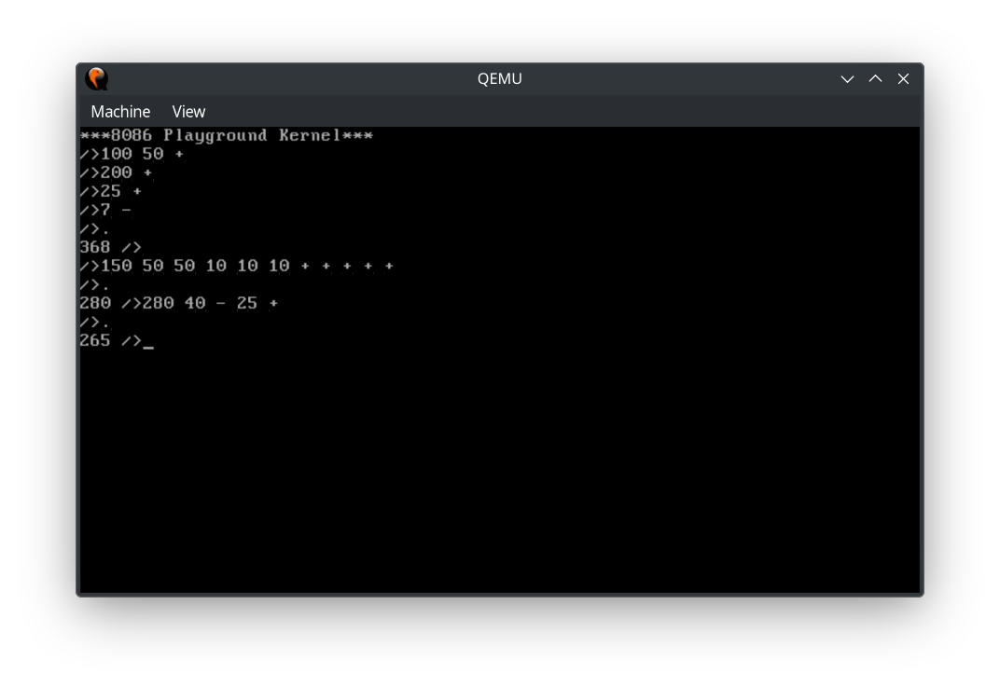

# 8086 Playground Kernel

## Explanation

* Currently in its "infancy"

* This is an experimental **just-for-fun** 8086 BIOS kernel

* The primary goal is to achieve an OS-lang combo: an OS that is also a programming language, and vice versa

* Generously inspired by **Forth**, but striving not to be limited by its possible restrictions

* Other architectures are also planned to be explored

## Tools

* Assembler: **NASM**
* Emulator: **QEMU** (**qemu-system-i386**)
* One small utility(options.bin generator) written in **C** (**GCC**)
* Build/run scripts written in **Bash**
  
  
  
  **Not-so-important tools:**
  * Text editor: **KWrite**
  
  * Terminal Emulator: **Yakuake**
  
  * Distro: **Fedora Kinoite 41** (then **distrobox'd** **Fedora 41**)
  
  
